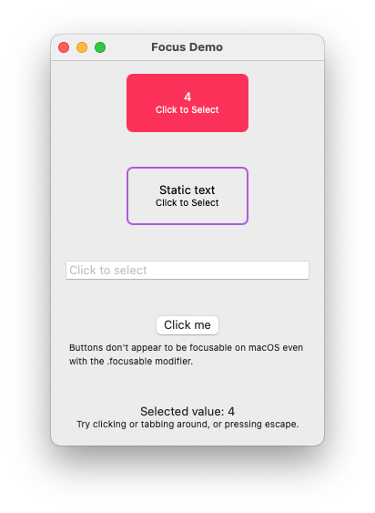

# swiftui-focus-demo

Demo app created to play around with SwiftUI and focus on macOS

## Introduction

This is a collection of experiments created to try to understand how focus and keyboard input behaves in SwiftUI, specificaly on macOS.

## Thoughts and Learnings

In the process of playing around with this, I've come across a collection of learnings that aren't easily captured in the code:

- `.focusable` only seems to work to make non-selectable items (`View`, `Button`, etc) tab-selectable (focusable) when the 'Use keyboard navigation to move focus between controls' is selected in System Preferences; I was surprised to see it doesn't even work for buttons, given what the documentation says.
- Hosted `NSView` instances that return `true` to `acceptsFirstResponder` can be 'focussed' on macOS, meaning that modifiers like `.onMoveCommand` and `.onExitCommand` then work (see `ResponderView` and `SelectableCounter` for examples of how this can be used to handle keyboard events on a 'native' SwiftUI component).
- `.focusable` is confusing in part because it describes only a very low-level UX semantic concept; it describes the idea that there is always a single focused item on screen. It should not be confused with 'selection', which allows for multiple items to be selected at once, or 'highlighting'.
   - It becomes consuing on macOS because the mechanism to change focus (using keyboard and mouse) is the exact same mechanism used to navigate through the elements on screen
   - `.focusable` is misleading because, on a platform like tvOS (for which I think most of the documentation is written) focus is enitrely sufficient to allow the user to navigate an app; it is an app with limited remote control input after all. The fact that focus is the only semantic expression required to allow us to navigate an app leads us (or me, at least) to expect it to be sufficient on a Mac. It's not. macOS (and nowadays iOS) is much more powerful and allows us to layer additional functionality on.
   - One might expect the  `.focusable` modifier to make a UI element selectable in this way (to allow it to select keyboard input), indeed, when one tabs around a Mac app, one is moving 'focus' from element to element. I argue that there needs to be another term to capture the top-level blocks or 'contexts' the user is engaging with.
- The language around focus just seems to be 'wrong' on macOS; on TV OS, it seems to be a proxy for selection, moving between selected buttons / shows using the remote, where the OS walks the view heirarchy to determine the selection. Tabs? Multi-selection? Highlight?
- Single window, single input / menu context? Should the UI be modal within this input context?
- Seem to already have modifiers for directly handling navigational input as high-level semantic callbacks; unfortunately these seem to be focused on tvOS and watchOS as the primary platforms and don't seem to provide mechanisms for navigational events like shift key plus direction, space key (e.g., to show the preview pane, etc).

SwiftUI is attempting to walk the line between a declarative way to express UI, and a semantic representation of the user experience (or at least the high-level elements at play); this necessarily means that, as a starting point at least, it's not designed to make widgets. Instead, it assembles the platform widgets. Where that goes wrong is some of the basic functionality just doesn't exist.
